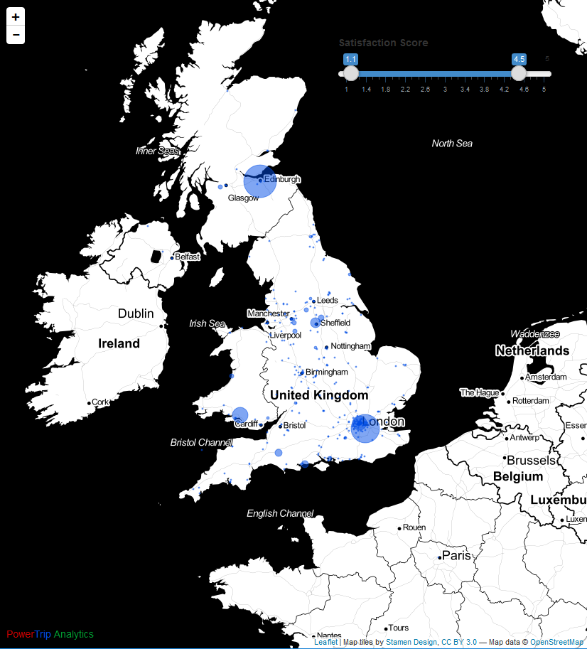

# shiny-map-leaflet-filtering

## Example 

## 🎉 About YakData

[YakData](https://yakdata.com/) is an agile forecasting firm delivering critical-path forecasts for new products, product acquisition, ad growth and sales force expansion to scale and grow your business. 

We build strategic forecasts for your business based on modern, advanced analytic languages and modular data stacks that are quick to develop and share with key stakeholders in your business.

[Successful projects](https://yakdata.com/success) have included forecasting new customer revenue by marketing channel at a leading subscription business, planning a 9-figure acquisition and investment decision at a leading biotech company, optimizing online ad-spend at a leading billion-dollar retailer, building mix-model multi-channel marketing forecasts at a multi-billion dollar video platform and estimating customer lifetime value in real-time at a leading online streaming business.

When you [hire YakData](https://yakdata.com/pricing/), our principals perform the majority of your high-value project work. Our primary mission is to be your trusted confidante as you make critical business investments and decisions. We deliver results that are presentation-ready for executive teams, boards of directors and key investors.
